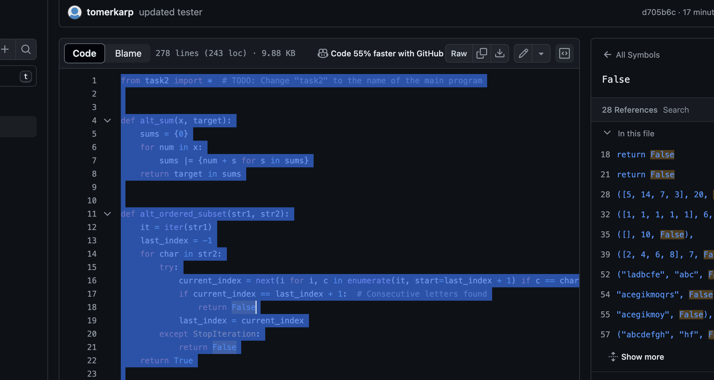
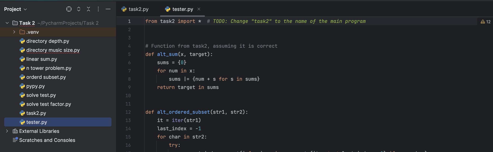
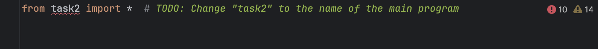

# tester


## התקנה
צריך ליצור קובץ פייטון חדש בפרויקט
ולהעתיק את קוד הבדיקה (tester.py) לקובץ חדש בתוך אותו פרויקט בפייצ׳רם


שיראה בסוף כך



## שינוי השם של הקובץ הראשי



במיקום של השם של הקובץ צריך לשנות לשם של הקובץ הגשה שלכם
```bash
# on the left side of TODO 
from '______' import * # Enter the name of your main file
```
